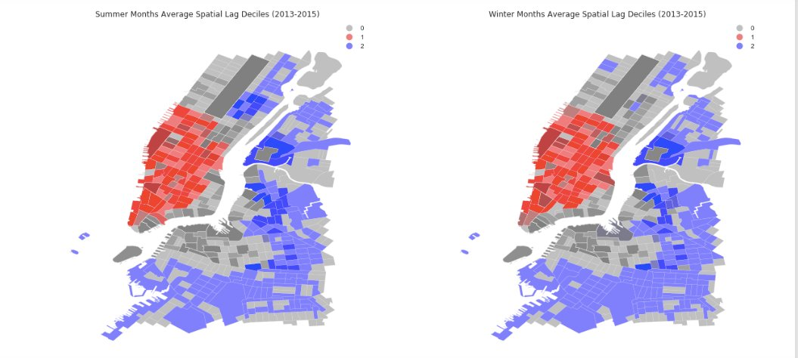
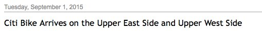

Seasonal Effect On Citibike Ridership:

My summer months are July, August and Sept and winter months are Nov, Dec, Jan.
Here is the picutre of two heatmaps of my Summer and Winter Months Average Spatial Lag Deciles (2013-2016)

By comparing two seasons, we can see there is slight difference between two maps. 
There are more cold spots in upper east side the summer time than winter, it might due to the weather drop.
In the winter map, we can see upper west side starts to have some cold spots, which could due to expansion on citi bikes.

Assignment 1&2:  I finished homework on my own. 
