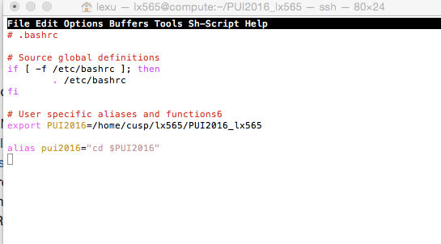
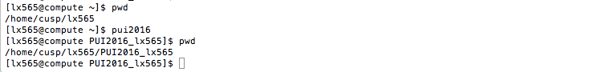

HOMEWORK 1

Assignment 2

I did this assignment by myself and I used some online resources for help, such as YOUTUBE Videos and Stackoverflow posts.

To set up my environment variables,
1. Open Mac terminal, connect to compute. 
write: echo export "PUI2016=/home/&*^&*" >> ~/.bashrc 
2. write: source ~/.bashrc
3. then : echo $PUI2016 will return the full path to directory

To set alias,
1. write: alias pui2016="cd $PUI2016" >> ~/.bashrc
2. write: source ~/.bashrc

----------------------
later on, I learned I can open "emacs ~/.bashrc" , then edit alias and env variables like just edit text.

-----------------

