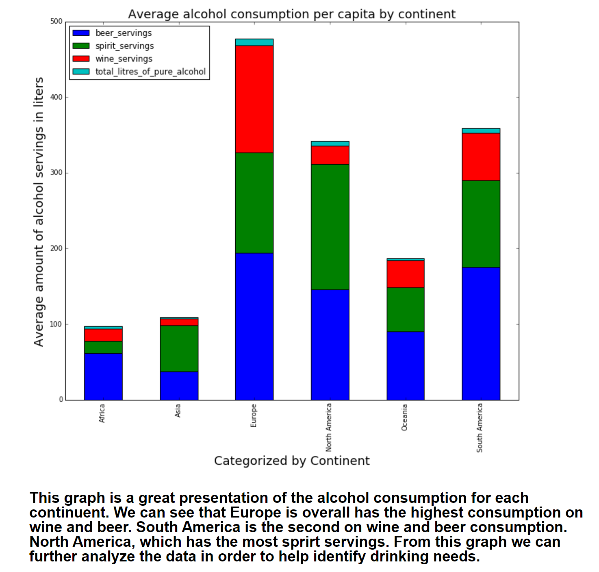

# Ben's Review of Le's Plot

Le's plot (above) shows per capital alcohol consumption aggregated to the continent level. It is easy to see that Europe drinks the most driven by their massive lead in wine consumption. 

Esthically, the plot is not too busy. It is easy to see total alcohol consumption and also compare each category across alcohol and continent type. There could be some improvement though. Red and green should never be used on the same plot in order to avoid color-blindness related complications, and the legend should be cleaned up a little. 

Suggestions for improvement:
- Shrink the plot a little so we can see the plot and the figure description at the same time
- Choose a more color-blind aware scheme
- Remove underscore from legend labels
