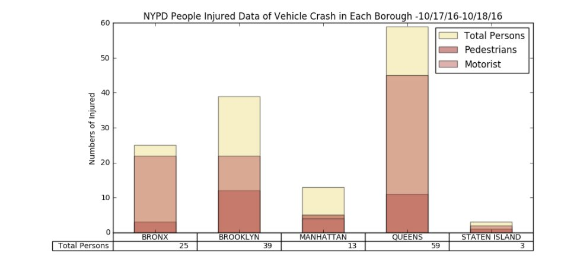

Comments:

Cui's plot has reasonable size. It has the right sized legend. It also includes the detailed title which tells us the data is from NYPD, and the date of the data. From the plot, we can tell the plot is trying to present NYPD's data on the number of people injuried during vehicle crash from each borough of New York City.

However, On the clarity part, the use of colors between Pedestrians and Motorist is similiar, which could be hard to differentiate under some situation. The numbers, also, seemed a little unclear/confusing to me. Cui individually marked out the numbers of total persons on the bottom, which I thought it could be the total of ALL injuried person, but the legend seemed only marked the top "khaki" colored bar as total persons. I am not sure if "total persons" is just one of the three categories or it represents the the general total. 

One more comment is, since each borough has different population, as Queens has more people driving so more injuries, so it will be better to normalized data in order to better interpret the data. 

Overall, it is a nice graph with decent look.
